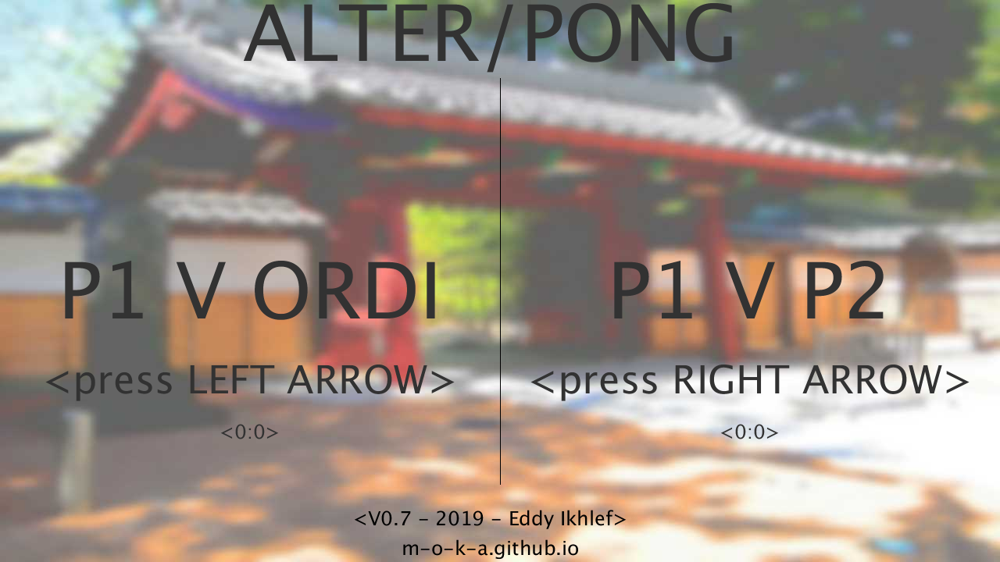
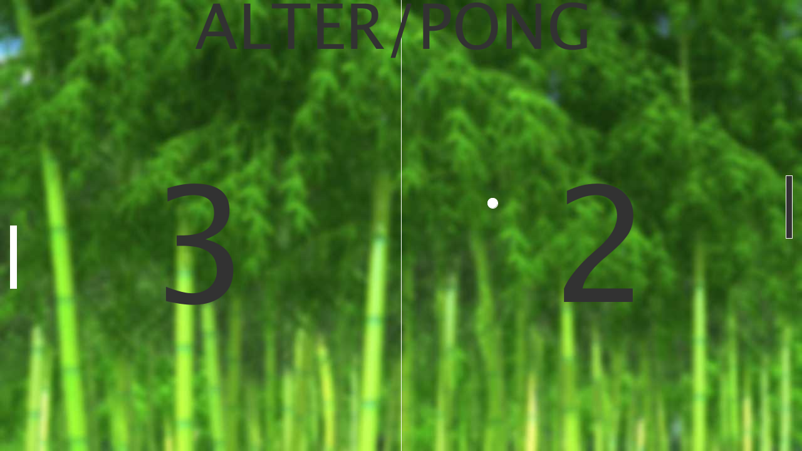

/*
*ALTER/PONG V0.4 
*DONE BY EDDY IKHLEF USING PROCESS 
*rules: 
* player(left) q to move up, w to move down 
* player(right) up to move up, down to move down 
* r to stop and go back to title screen (saved scores) 
*ALTERNATIVE PONG, each player can't move after send the ball until the other player touch it 
*Adding with unstopable platform, and ball who take speed, it make the pong harder than ever ! 
*/ 
 
/* 
*Upcoming in V0.5 
*Sound Feedback 
*/ 
/* 
*Upcoming in V0.6 
*Upgrade pseudo-IA system and hitboxes 
*/ 
/* 
*Upcoming in V0.7 
*??? 
*/ 
/* 
*Upcoming in V0.8 
*??? 
*/ 
/* 
*Upcoming in V0.9 
*Computer Difficulties 
*/ 
/* 
*Upcoming in V1.0 
*??? 
*/ 
 
 
/************************************************************************************************* 
*************************************************************************************************/ 
/* 
*V0.1 
*Base Game, player 1 vs player 2  
*/ 
/* 
*V0.2 
*Title Screen, Reload, Launch Game 
*/ 
/* 
*V0.3 
*Player 1 vs Computer Mode 
*/ 
/* 
*V0.4 
*Highscore saved in local for each game mode 
*/ 